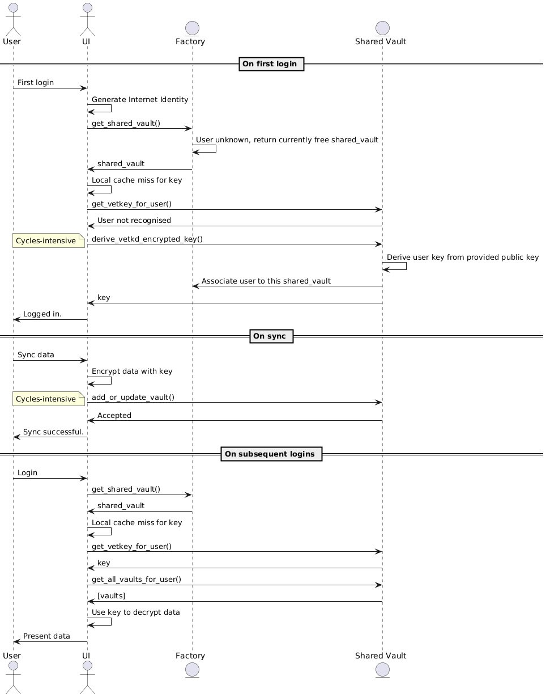

# GhostKeys Vault Canister

A production‑grade Internet Computer (ICP) canister that stores **encrypted secrets** for GhostKeys (humans and machines). It implements a **zero‑friction, client‑first encryption model** with **vetKD** (verifiable encryption to a derived key) so the canister never handles plaintext.

> TL;DR: **Encrypt on the client, store on the canister, never trust the network.**

---

## Table of Contents

* [Purpose](#purpose)
* [What’s in a Vault](#whats-in-a-vault)
* [High‑Level Architecture](#high-level-architecture)
* [Security Model](#security-model)
* [Data Model](#data-model)
* [Local Dev: build, deploy, call](#local-dev-build-deploy-call)
* [Build & Release Artifacts](#build--release-artifacts)
* [Stable Memory & Upgrades](#stable-memory--upgrades)

---

## Purpose

The **Vault Canister** holds encrypted secrets (passwords, API keys, JSON blobs, etc.) and minimal associated metadata. It is designed to be used in two deployment modes:

1. **Shared Vault (Free tier)** — multi‑tenant storage with strict logical isolation per `owner` (principal hash) and strong client‑side encryption.
2. **Dedicated Vault (Premium)** — **canister‑per‑user** created by the Factory canister for custom enterprise builds.

In both modes, the canister persists only opaque **ciphertext** provided by the client, plus minimal metadata required for indexing and UI rendering.

---

## What’s in a Vault

A *vault* is a **named container** of multiple secret collections:

* **Website logins** — list of website identifiers with a vector of key/value pairs (username, password, notes, etc.). Values should be ciphertext strings for sensitive fields.
* **Secure notes** — `(title, body)` pairs. Body should be ciphertext.
* **Flexible grid** — a spreadsheet‑style grid with **column schema** and **(row,col) keyed cells**. A boolean flag per column indicates *secret/plain* so UIs know whether to obscure their cells. Note that this is only a visual effect to prevent shoulder surfing - we still recommend encrypting everything by default.

---

## High‑Level Architecture



* **Client does all sensitive crypto**. The canister validates and stores.
* **vetKD** support allows deriving an encryption key bound to an identity/public info without exposing a raw key on chain.
* **Stable memory** via `ic-stable-structures` persists data across upgrades.

**Primary crates** used:

* `ic-cdk` & `ic-cdk-macros` (0.18.x)
* `ic-stable-structures` (0.7.x)
* `candid` (0.10.x)
* `ic-vetkeys` (0.4.x) — helper for vetKD workflows

> Exact versions are pinned in `Cargo.toml`.

---

## Security Model

**Trust boundaries**

* **Plaintext never leaves the client.**
* The canister stores: ciphertext, nonces/IVs, auth tags, public params, and safe metadata.
* Access control is enforced by **caller principal** (`msg_caller`) and optional ACLs/owners per record.

**Key flows ([Check ghostkeys-app for the full flow description](https://github.com/Ghostkeys-App/ghostkeys-app))**

* **Client‑managed keys**: user/device generates and holds symmetric keys; rotates locally.
* **vetKD‑assisted envelope**: client derives a public parameter and requests a **vetkd\_encrypted\_key** from the canister/management function; client decrypts locally and uses it to encrypt payloads. Canister never sees plaintext nor the raw key.

**Do not**

* Store plaintext or derived raw keys in stable memory.
* Log secrets or derived material.
* Return secrets in plaintext from the canister. All reads return ciphertext.


---

## Interfaces

**Syncs**

- Performed using a purpose-built serialisation protocol, optimised for responsiveness and lean payloads. 
- It is strongly recommended to use the provided [ghostkeys sdk](https://github.com/Ghostkeys-App/ghostkeys-sdk) to serialise data before sending it to vault endpoints.

**Fetches**

- Return structures for vault data, designed for ease of use. 
- The candid file contains the definitions for integration with client.
---

## Local Dev: build, deploy, call

### Prereqs

* Rust toolchain + `wasm32-unknown-unknown`
* `dfx >= 0.17`

```bash
rustup target add wasm32-unknown-unknown

# Build and run unit tests
cargo test

# Start local replica
dfx start --clean --background

# Deploy
dfx deploy

# Generate declarations (if your UI needs them)
dfx generate vault-canister-backend
```

## Build & Release Artifacts

The CI builds produce:

* `vault_canister_backend.wasm` — optimized WASM
* `shared-vault-canister-backend.did` — Candid interface

> Releases are consumed by the **Factory Canister** (and by UIs using custom fetch scripts with remote `wasm`/`candid` URLs and `dfx.json`).

---

## Stable Memory & Upgrades

* **Storage**: uses stable structures (e.g., BTreeMaps) divided by data type for efficient and fast retrieval, keyed by `(user_id, vault_name)` → `Data`.
* **Isolation**: in shared mode, authorization is by **caller principal + user mapping**; do not expose cross‑user reads. In dedicated mode, the controller set (Factory + ops) governs access.
* **Secure Access**: Callers are only able to retrieve their data. *All* data is securely client-side encrypted, protecting secrets even in the case of canister leaks.